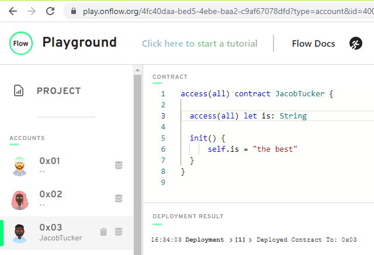
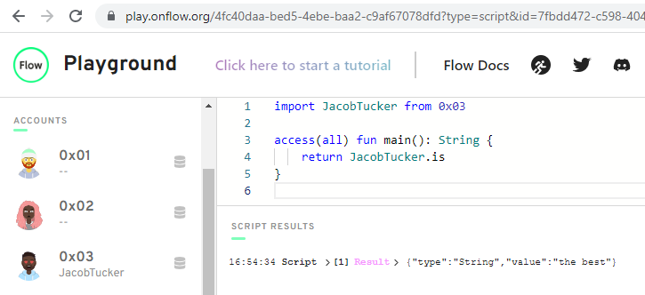

# Chapter 2

## Day 1

**1) Deploy a contract to account 0x03 called "JacobTucker". Inside that contract, declare a constant variable named is, and make it have type String. Initialize it to "the best" when your contract gets deployed.**
  

  
**2) Check that your variable is actually equals "the best" by executing a script to read that variable. Include a screenshot of the output.**
  

  

