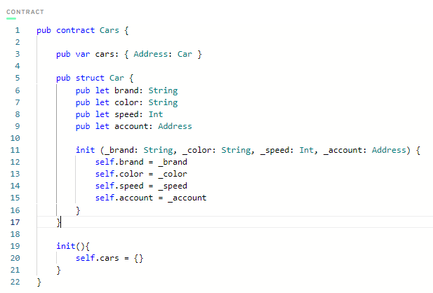

# Chapter 2

## Day 1

**1) Deploy a contract to account 0x03 called "JacobTucker". Inside that contract, declare a constant variable named is, and make it have type String. Initialize it to "the best" when your contract gets deployed.**
  

  
**2) Check that your variable is actually equals "the best" by executing a script to read that variable. Include a screenshot of the output.**
  

  

## Day 2

**1) Explain why we wouldn't call changeGreeting in a script.**     
Because a script cannot alter data stored on the Blockchain.

**2) What does the AuthAccount mean in the prepare phase of the transaction?**      
AuthAccount is used to access data in the user account.       
Whenever a transaction is signed, the AuthAccount type is used to access signer's account information.

**3) What is the difference between the prepare phase and the execute phase in the transaction?**        
Prepare phase: access the information/data in user account.        
Execute phase: change the data on the blockchain. Unlike the prepare phase, the execute phase also cannot access user's account data.

**4.1) Add two new things inside your contract:**     
**A variable named myNumber that has type Int (set it to 0 when the contract is deployed)**         
**A function named updateMyNumber that takes in a new number named newNumber as a parameter that has type Int and updates myNumber to be newNumber**        
  

  

**4.2) Add a script that reads myNumber from the contract**            
  

  

**4.3) Add a transaction that takes in a parameter named myNewNumber and passes it into the updateMyNumber function. Verify that your number changed by running the script again.**     
  

  

## Day 3

**1) In a script, initialize an array (that has length == 3) of your favourite people, represented as Strings, and log it.**        
  

  

**2) In a script, initialize an array (that has length == 3) of your favourite people, represented as Strings, and log it.**        
  

  

**3) Explain what the force unwrap operator ! does, with an example different from the one I showed you (you can just change the type).**
The force-unwrap operator "unwraps" an optional type, returns the value if present or returns error (PANIC) if the value is not present (nil).
  

  

**4) Using this picture below, explain...**        
**What the error message means**      
The script should returns a String but actually returns a String? (optional).

**Why we're getting this error**      
The force-unwrap operator is missing / return type of the script is not optional (string?).

**How to fix it**     
...
return thing[0x03]!

## Day 4

**1) Deploy a new contract that has a Struct of your choosing inside of it (must be different than Profile).**       
  

  

**3) Create a dictionary or array that contains the Struct you defined.**      
  

  

**3) Create a function to add to that array/dictionary.**    
  

  

**4) Add a transaction to call that function in step 3.**     
  

  

**5) Add a script to read the Struct you defined.**       
  

  

