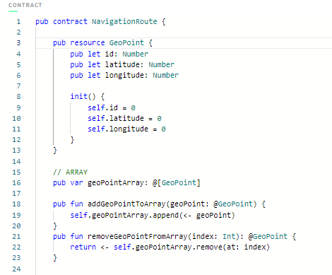
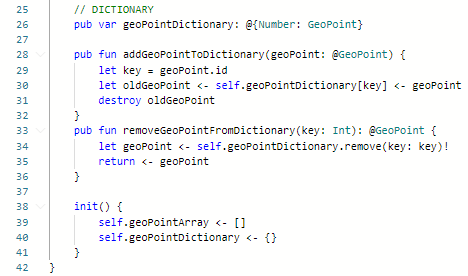

# Chapter 3

## Day 1

**1) In words, list 3 reasons why structs are different from resources.**      
*  Resources cannot be copied, only destroyed or moved.
*  Resources are extremely secure and hard to lose.
*  Resources have a strict specific syntax.

**2) Describe a situation where a resource might be better to use than a struct.**    
If you want to move some important or sensitive data (ex. documents, NFTs) and be sure that the data will not be lost.

**3) What is the keyword to make a new resource?**    
"create"

**4) Can a resource be created in a script or transaction (assuming there isn't a public function to create one)?**    
No, resources must be created inside the contract.

**5) What is the type of the resource below?**          
@Jacob

**6) Let's play the "I Spy" game from when we were kids. I Spy 4 things wrong with this code. Please fix them.**  
<pre>
pub contract Test {        
    pub resource Jacob {           
        pub let rocks: Bool           
        init() {           
            self.rocks = true           
        }           
    }           
    pub fun createJacob(): <b>@Jacob</b>¹ {           
        let myJacob <b><-</b>² <b>create</b>³ Jacob()            
        return <b><-</b>⁴ myJacob           
    }           
}           
</pre>

## Day 2           

**1) Write your own smart contract that contains two state variables: an array of resources, and a dictionary of resources. Add functions to remove and add to each of them. They must be different from the examples above.**    
  

  

